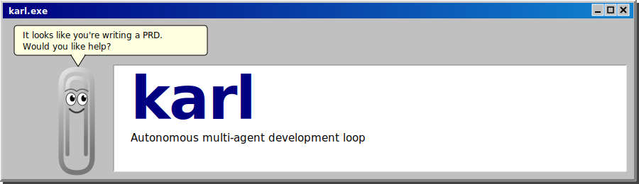
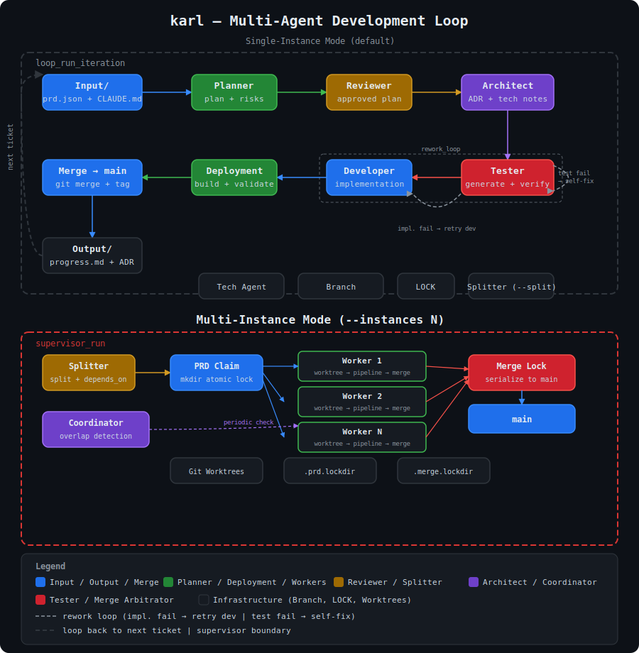

<div align="center">
  
</div>

---

**karl** is an autonomous multi-agent development loop built on top of the [Claude CLI](https://docs.anthropic.com/claude/docs/claude-cli). It reads a product requirements document (PRD), selects the highest-priority unfinished ticket, and orchestrates a team of specialized AI agents to plan, review, architect, test, implement, and deploy the feature — then loops to the next ticket.

With `--instances N`, karl can process multiple tickets in parallel using **git worktrees** for filesystem isolation, with a supervisor that coordinates workers, detects file overlap, and serializes merges to main.

## Name

The name **karl** is a nod to **Karl Klammer** — the German name of the animated paper-clip assistant that shipped with Microsoft Word from 1997 to 2003 (known internationally as *Clippy*). *Klammer* means *paper clip* in German. Like its namesake, karl shows up uninvited, offers help you didn't ask for, and won't stop until the job is done.

---

## Architecture

### Single-Instance Mode (default)



Each ticket iteration runs through a deterministic pipeline:

```
Input/prd.json → Planner → Reviewer → Architect → Tester → Developer → Deployment → Merge → main
                                                            └──── rework loop ────┘
```

The rework loop runs exclusively between **Tester** and **Developer**: Tester generates failing tests first, then after each Developer implementation attempt, Tester verifies. On implementation failure, Developer retries. On test failure, Tester self-corrects its own test and re-verifies without re-running Developer.

### Multi-Instance Mode (`--instances N`)

When N > 1, karl spawns parallel workers, each in its own git worktree:

```
karl.sh → [splitter_run] → supervisor_run
  ├─ worker 1: claim → worktree_create → loop_run_ticket → merge_arbitrator_merge → cleanup
  ├─ worker 2: claim → worktree_create → loop_run_ticket → merge_arbitrator_merge → cleanup
  └─ coordinator: periodic overlap check across active worktrees
```

Each worker atomically **claims** a ticket (via `mkdir`-based POSIX locks on `prd.json`), creates an isolated git worktree, runs the full agent pipeline, then acquires a **merge lock** to serialize the merge into main. If a worker fails, the ticket is released back to `"available"` for retry.

---

## Prerequisites

| Tool | Purpose |
|------|---------|
| [Claude CLI](https://docs.anthropic.com/claude/docs/claude-cli) | Runs AI agents |
| `git` | Branch management, merging, and worktrees |
| [bats-core](https://github.com/bats-core/bats-core) | Running the test suite |
| `bash` ≥ 3.2 | Shell runtime (macOS and Linux compatible) |

Install bats-core:

```bash
# macOS
brew install bats-core

# Ubuntu / Debian
apt-get install bats
```

---

## Installation

```bash
git clone https://github.com/kayoslab/karl.git
cd karl
chmod +x ./karl.sh
```

No build step required — karl is pure bash.

---

## Usage

### Run karl against your workspace

```bash
./karl.sh --workspace <path>
```

If `--workspace` is omitted, the directory containing `karl.sh` is used as the workspace root.

### Run with ticket splitting

```bash
./karl.sh --workspace <path> --split
```

The `--split` flag invokes the **Splitter** agent before the main loop. It analyzes complex tickets and breaks them into smaller, parallelizable sub-tickets with dependency tracking.

### Run multiple workers in parallel

```bash
./karl.sh --workspace <path> --instances 3
```

This spawns 3 workers, each processing tickets concurrently in isolated git worktrees. Workers atomically claim tickets and serialize merges to main.

### Combine splitting with parallel execution

```bash
./karl.sh --workspace <path> --split --instances 4
```

### Reset the workspace

```bash
./karl.sh --clean            # checkout main, remove LOCK file, clean worktrees
./karl.sh --clean --force    # also discard all uncommitted changes
```

---

## Configuration

karl is configured exclusively via command-line parameters.

| Parameter | Default | Description |
|-----------|---------|-------------|
| `--max-retries <n>` | `10` | Max rework cycles per ticket before marking failed |
| `--workspace <path>` | karl directory | Workspace root directory |
| `--force-lock` | off | Override a stale LOCK file from a previous run |
| `--auto-init-git` | off | Initialize a git repository without prompting |
| `--dry-run` | off | Validate setup and show next ticket without modifying code |
| `--split` | off | Run splitter agent on prd.json before the loop |
| `--instances <n>` | `1` | Run N parallel workers via git worktrees |
| `--worktree-dir <path>` | `../.karl-worktrees` | Base directory for worktrees |

---

## Folder Structure

Agents are **part of karl** and live alongside `karl.sh`. Your workspace only needs the project inputs:

```
karl/                    # karl installation
├── karl.sh
├── Agents/              # Built-in agent prompt files (one per role)
│   ├── planner.md
│   ├── reviewer.md
│   ├── architect.md
│   ├── tester.md
│   ├── developer.md
│   ├── deployment.md
│   ├── tech.md
│   ├── splitter.md          # Ticket splitting (--split)
│   ├── coordinator.md       # Overlap detection (--instances > 1)
│   └── merge_arbitrator.md  # Conflict resolution (--instances > 1)
└── lib/

workspace/               # Your project (pointed to via --workspace)
├── Input/
│   └── prd.json         # Product requirements (array of tickets)
├── Output/
│   ├── ADR/             # Architecture Decision Records
│   ├── progress.md      # Completed ticket log
│   └── tech.md          # Auto-generated technology summary
└── CLAUDE.md            # Project context injected into every agent
```

---

## Agents

Agents are bundled with karl in the `Agents/` directory alongside `karl.sh` — your workspace does not need to include them. Each agent is a markdown file with a YAML frontmatter block defining its role, inputs, outputs, and constraints. karl fills in `{{placeholder}}` variables before invoking Claude CLI.

### Core Agents (always active)

| Agent | Role |
|-------|------|
| **planner** | Reads the ticket and produces a concrete implementation plan as JSON |
| **reviewer** | Reviews and approves (or rejects) the plan before work begins |
| **architect** | Makes architectural decisions and writes ADR records |
| **tester** | Writes failing tests that define the acceptance criteria |
| **developer** | Implements the ticket to make the tests pass |
| **deployment** | Runs build/lint/test commands, validates the implementation, and updates README/docs to reflect any changes introduced by the ticket |
| **tech** | Discovers the technology stack once on first boot |

### Supervisory Agents (multi-instance)

| Agent | Activation | Role |
|-------|------------|------|
| **splitter** | `--split` | Analyzes tickets and splits complex ones into smaller, parallelizable sub-tickets with dependency tracking |
| **coordinator** | `--instances > 1` | Detects file overlap between concurrent workers and decides whether to pause, continue, or reorder |
| **merge_arbitrator** | `--instances > 1` | Resolves merge conflicts when a worker's branch conflicts with main |

### Customising agents

To modify agent behaviour, edit the corresponding file in `karl/Agents/`. The frontmatter `constraints` field is enforced by karl's output parser. Add new instructions in the `## Responsibilities` section.

To add a new agent role, create `karl/Agents/myrole.md` with the standard frontmatter format and register it in `lib/agents.sh`.

---

## CLI Commands

```
./karl.sh [options]

Options:
  --workspace <path>       Workspace root directory (default: karl directory)
  --max-retries <n>        Max rework cycles per ticket (default: 10)
  --force-lock             Override a stale LOCK file from a previous run
  --auto-init-git          Initialize a git repository without prompting
  --dry-run                Validate setup and show next ticket without modifying code
  --clean                  Reset workspace: checkout main, remove LOCK, clean worktrees
  --force                  Used with --clean: also discard uncommitted changes
  --split                  Run splitter agent on prd.json before the loop
  --instances <n>          Run N parallel workers via git worktrees (default: 1)
  --worktree-dir <path>    Base directory for worktrees (default: ../.karl-worktrees)
  --help                   Show this help message
```

---

## Example Workspace

The `example/` directory contains a minimal working workspace you can copy to get started:

```bash
chmod +x karl.sh
cp -r example/ my-project
# Edit my-project/Input/prd.json with your tickets
# Edit my-project/CLAUDE.md with your project context
./karl.sh --workspace my-project/
```

See `example/Input/prd.json` for the ticket schema. You do **not** need to copy any agent files — agents are bundled with karl.

---

## How Tickets Work

### prd.json schema

`Input/prd.json` is a JSON object with a `userStories` array:

```json
{
  "project": "your-project",
  "userStories": [
    {
      "id": "US-001",
      "title": "Short feature title",
      "description": "As a user, I want...",
      "acceptanceCriteria": ["Criterion 1", "Criterion 2"],
      "priority": 1,
      "passes": false,
      "status": "available",
      "depends_on": [],
      "split_from": null,
      "notes": "Optional implementation notes"
    }
  ]
}
```

| Field | Type | Default | Description |
|-------|------|---------|-------------|
| `id` | string | *required* | Unique ticket identifier (e.g., `"US-001"`) |
| `title` | string | *required* | Short feature title |
| `description` | string | *required* | Feature description |
| `acceptanceCriteria` | string[] | *required* | Testable criteria |
| `priority` | number | *required* | Lower = higher priority |
| `passes` | boolean | `false` | Whether the ticket has passed |
| `status` | string | derived | `"available"` \| `"in_progress"` \| `"pass"` \| `"fail"` |
| `depends_on` | string[] | `[]` | Ticket IDs that must pass before this one starts |
| `split_from` | string | `null` | Parent ticket ID if created by the splitter |

**Backward compatibility:** The `status`, `depends_on`, and `split_from` fields are optional. Existing `prd.json` files that only use `passes` continue to work unchanged — karl derives the effective status from `passes` when `status` is absent.

karl picks the ticket with the lowest `priority` value where the effective status is `"available"` (and all `depends_on` tickets have passed) and loops until all tickets pass.

### Ticket iteration

Each selected ticket runs through these stages in order:

1. **Planner** — produces a concrete implementation plan; **Reviewer** approves or rejects before work begins
2. **Architect** — evaluates architectural impact and writes an ADR record when a decision is needed
3. **Tester** — generates failing tests that define the acceptance criteria (test-first)
4. **Rework loop** — Developer implements; Tester verifies after each attempt:
   - Implementation failure → Developer retries (up to `--max-retries` cycles)
   - Test failure → Tester self-corrects the test, then re-verifies without re-running Developer
5. **Deployment** — runs build/lint/test commands to gate the final result; updates README and docs to reflect changes
6. **Merge** — feature branch is merged to `main`; `passes` is set to `true` in `prd.json`; `Output/progress.md` is updated

In multi-instance mode, steps 1–5 run in an isolated git worktree, and step 6 uses the **merge arbitrator** to serialize merges.

---

## Running Tests

```bash
bats tests/
```

All business logic is covered by BATS tests in `tests/`.

---

## Contributing

Contributions are welcome. karl is intentionally simple — please keep that spirit when submitting changes.

### How to contribute

1. Fork the repository and create a feature branch from `main`
2. Follow the existing code style — pure bash, platform-independent (`bash ≥ 3.2`)
3. Add or update BATS tests in `tests/` for any business logic you touch
4. Run the quality gates before opening a pull request:
   ```bash
   shellcheck lib/*.sh    # must pass with no errors
   bats tests/            # all tests must pass
   ```
5. Keep commit messages in the `type: [US-XXX] description` format used throughout the project
6. Open a pull request with a clear description of what changed and why

### Guidelines

- **No dependencies beyond bash, git, jq, and the Claude CLI.** karl is intentionally dependency-light so it runs anywhere.
- **Tests are mandatory.** Every new function in `lib/` should have corresponding tests in `tests/`.
- **shellcheck is non-negotiable.** All shell scripts must pass `shellcheck` with zero warnings.
- **Keep agents modular.** New agent roles belong in `Agents/` as a markdown file, not baked into shell logic.
- **ADR for architecture decisions.** If your change introduces a significant technical decision, add an ADR under `Output/ADR/`.

### Reporting issues

Please open a GitHub issue with a minimal reproduction case. Include your OS, bash version (`bash --version`), and the relevant output from karl.

---

## License

See [LICENSE.md](LICENSE.md) for the full MIT license text.
